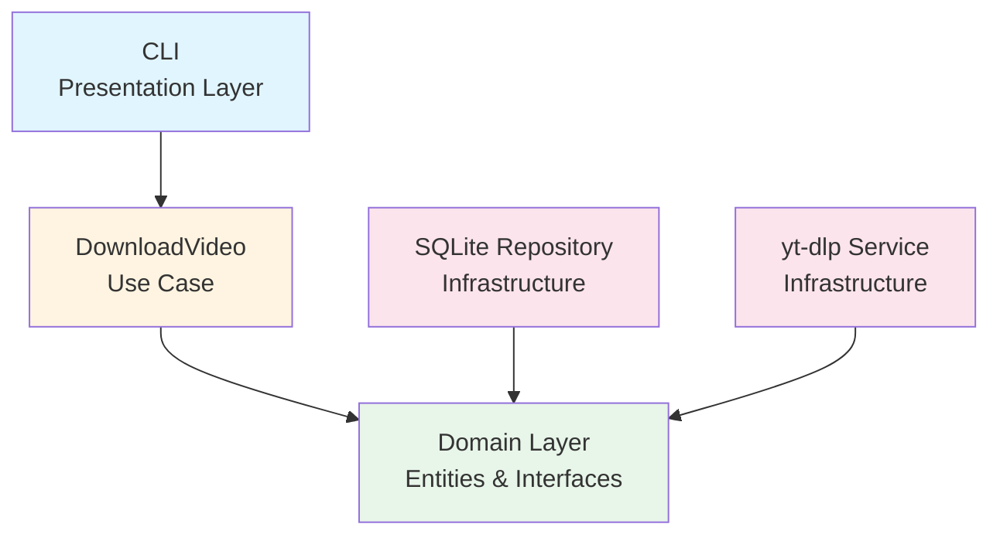

# YouTube Video Downloader 🎥

[](https://github.com/rafaelmachadobr/video-download-youtube/actions)
[](https://www.python.org/downloads/)
[](https://github.com/psf/black)
[](LICENSE)

Sistema de download de vídeos do YouTube.

## 📋 Características

- ✅ **Clean Architecture** - Separação clara de responsabilidades em camadas
- ✅ **SOLID Principles** - Código manutenível e extensível
- ✅ **Type Hints** - Tipagem estática para melhor autocomplete e validação
- ✅ **Dependency Injection** - Baixo acoplamento entre componentes
- ✅ **Exception Handling** - Tratamento robusto de erros
- ✅ **Logging** - Sistema completo de rastreamento
- ✅ **Unit Tests** - Cobertura de testes > 80%
- ✅ **Cross-platform** - Funciona em Windows, Linux e macOS
- ✅ **CI/CD** - Pipeline completo com GitHub Actions
- ✅ **Security Scanning** - CodeQL para análise de vulnerabilidades
- ✅ **Auto-updates** - Dependabot para manter dependências atualizadas

## 🏗️ Arquitetura

```
src/
├── domain/           # Regras de negócio e abstrações
│   ├── entities.py      # Entidades do domínio
│   ├── repositories.py  # Interfaces de repositórios
│   ├── services.py      # Interfaces de serviços
│   └── exceptions.py    # Exceções customizadas
├── usecases/         # Casos de uso da aplicação
│   └── download_video.py
├── infrastructure/   # Implementações concretas
│   ├── sqlite_repo.py    # Repositório SQLite
│   └── yt_dlp_service.py # Serviço de download
└── presentation/     # Interface com usuário
    └── cli.py           # Interface CLI
```

### Diagrama de Dependências



## 🚀 Como Usar

### Pré-requisitos

- Python 3.10 ou superior
- pip

### Instalação

1. Clone o repositório:

```bash
git clone https://github.com/rafaelmachadobr/video-download-youtube.git
cd video-download-youtube
```

2. Instale as dependências:

```bash
pip install -r requirements.txt
```

### Execução

```bash
python main.py
```

## 🧪 Testes

### Rodar todos os testes

```bash
pytest
```

### Rodar com cobertura

```bash
pytest --cov=src --cov-report=html
```

### Rodar testes específicos

```bash
pytest tests/usecases/test_download_video.py
```

### Ver relatório de cobertura

```bash
# Gera relatório HTML
pytest --cov=src --cov-report=html

# Abra htmlcov/index.html no navegador
```

## 🔍 Qualidade de Código

### Linting

```bash
flake8 src/
```

### Formatação

```bash
black src/ tests/
```

### Type Checking

```bash
mypy src/
```

## 📦 Estrutura de Dependências

### Produção

- `yt-dlp` - Download de vídeos

### Desenvolvimento

- `pytest` - Framework de testes
- `pytest-cov` - Cobertura de código
- `flake8` - Linter
- `black` - Formatador de código
- `mypy` - Type checker

## � CI/CD

O projeto utiliza **GitHub Actions** para automação completa:

### 🚀 Workflows Configurados

#### 1. **CI Pipeline** (`.github/workflows/ci.yml`)

- ✅ Executa em: Push e Pull Requests
- ✅ Testa em múltiplos ambientes:
  - **OS**: Ubuntu, Windows, macOS
  - **Python**: 3.8, 3.9, 3.10, 3.11, 3.12
- ✅ Validações:
  - Linting com flake8
  - Testes com pytest
  - Cobertura mínima de 80%
  - Formatação com black
  - Type checking com mypy
- ✅ Upload de cobertura para Codecov

#### 2. **Release Pipeline** (`.github/workflows/release.yml`)

- ✅ Dispara ao criar tags `v*` (ex: `v1.0.0`)
- ✅ Cria releases automaticamente no GitHub
- ✅ Roda todos os testes antes da release

#### 3. **Security Scan** (`.github/workflows/codeql.yml`)

- ✅ Análise de segurança com CodeQL
- ✅ Executa semanalmente e em PRs
- ✅ Detecta vulnerabilidades automaticamente

## 🛡️ Princípios SOLID Implementados

### Single Responsibility Principle (SRP)

- Cada classe tem uma única responsabilidade
- `DownloadVideo` - apenas orquestra o download
- `SQLiteVideoRepository` - apenas persiste dados
- `YTDLPService` - apenas faz download

### Open/Closed Principle (OCP)

- Aberto para extensão, fechado para modificação
- Novas implementações de `VideoRepository` podem ser criadas sem alterar código existente

### Liskov Substitution Principle (LSP)

- Implementações podem ser substituídas pelas interfaces
- `SQLiteVideoRepository` pode ser substituído por qualquer implementação de `VideoRepository`

### Interface Segregation Principle (ISP)

- Interfaces específicas e coesas
- `VideoRepository` e `VideoDownloaderService` têm métodos bem definidos

### Dependency Inversion Principle (DIP)

- Dependências apontam para abstrações
- `DownloadVideo` depende de `VideoRepository` e `VideoDownloaderService` (abstrações), não de implementações concretas

## 📝 Logs

Os logs são salvos automaticamente em arquivos separados por data:

- **Formato**: `logs/YYYY-MM-DD.log` (ex: `2026-02-09.log`)
- **Conteúdo**: Informações de execução, erros, exceções e timestamps
- **Console**: Logs não são exibidos no terminal (apenas salvos em arquivo)
- **Organização**: Um arquivo por dia para facilitar análise histórica

## 📄 Licença

Este projeto está licenciado sob a licença MIT - veja o arquivo [LICENSE](LICENSE) para detalhes.
